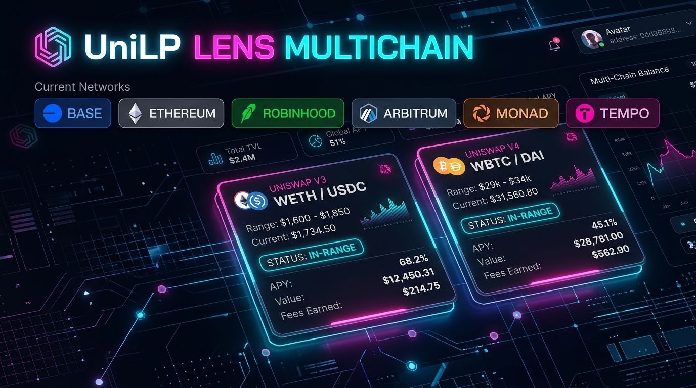
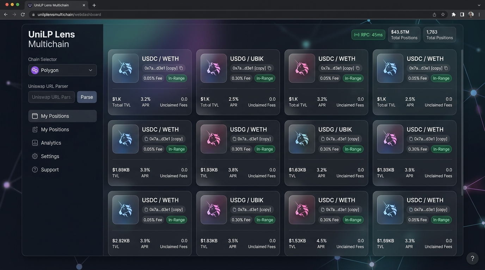

# UniLP Lens Multichain

<p align="center">
  
</p>

<p align="center">
  <strong>Universal On-Chain Position Intelligence for Uniswap V3 & V4 across 22+ EVM Networks</strong><br>
  <em>Read-only high-performance dashboard to track NFT liquidity positions, owner wallets, pool metadata, and burned transfer history.</em>
</p>

<p align="center">
  <a href="#-bahasa-indonesia">🇮🇩 Bahasa Indonesia</a> • 
  <a href="#-english">🇬🇧 English</a> • 
  <a href="#-multichain-support-matrix-22-networks">🌐 Multichain Matrix</a> • 
  <a href="#-tampilan-aplikasi--ui-preview">📸 UI Preview</a> • 
  <a href="#-author--credits">💎 Author & Credits</a> • 
  <a href="#-support--donations">☕ Support</a>
</p>

---

## 📸 Tampilan Aplikasi / UI Preview

<p align="center">
  <em>Modern 1-Viewport Dashboard Layout (Sidebar Controls + Internal Scrollable Grid):</em><br>
  
</p>

---

## 🌐 Multichain Support Matrix (22+ Networks)

UniLP Lens mendukung **22 jaringan blockchain EVM** secara langsung dengan preset RPC, Chain ID, dan smart contract PositionManager untuk Uniswap V3 maupun V4:

| Network | Chain ID | Uniswap Ver. | Official PositionManager Address | Explorer |
| :--- | :---: | :---: | :--- | :--- |
| **Robinhood Chain** | `4663` | V3 / V4 | `0x58daec3116aae6D93017bAAea7749052E8a04fA7` (V4)<br>`0x73991a25c818bf1f1128deaab1492d45638DE0D3` (V3) | [Explorer](https://explorer.mainnet.chain.robinhood.com) |
| **Ethereum Mainnet** | `1` | V3 / V4 | `0xC36442b4a4522E871399CD717aBDD847Ab11FE88` (V3)<br>`0xbD216513d74C8cf14cf4747E6AaA6420FF64ee9e` (V4) | [Etherscan](https://etherscan.io) |
| **Base** | `8453` | V3 / V4 | `0x03a520b32C04BF3bEEf7BEb72E919cf822Ed34f1` (V3)<br>`0x7C40c3a61b4A5A30598816c17e33555Ec9BE39d5` (V4) | [Basescan](https://basescan.org) |
| **Arbitrum One** | `42161` | V3 / V4 | `0xC36442b4a4522E871399CD717aBDD847Ab11FE88` (V3)<br>`0x360E68faCcca8cA495c1B759Fd9EEe466db9FB32` (V4) | [Arbiscan](https://arbiscan.io) |
| **OP Mainnet** | `10` | V3 / V4 | `0xC36442b4a4522E871399CD717aBDD847Ab11FE88` (V3)<br>`0x360E68faCcca8cA495c1B759Fd9EEe466db9FB32` (V4) | [Optimistic](https://optimistic.etherscan.io) |
| **Polygon PoS** | `137` | V3 / V4 | `0xC36442b4a4522E871399CD717aBDD847Ab11FE88` (V3)<br>`0x360E68faCcca8cA495c1B759Fd9EEe466db9FB32` (V4) | [Polygonscan](https://polygonscan.com) |
| **BNB Chain** | `56` | V3 / V4 | `0x7b8A01B39D58278b5DE7e48c8449c9f4F5170613` (V3)<br>`0x360E68faCcca8cA495c1B759Fd9EEe466db9FB32` (V4) | [BscScan](https://bscscan.com) |
| **Avalanche C-Chain** | `43114` | V3 | `0x655C406EBFa14EE2006250925e54ec43AD184f8B` | [Snowtrace](https://snowtrace.io) |
| **Celo** | `42220` | V3 | `0x3d79EdAaBC0EaB6F08ED885C05Fc0B014290D95A` | [Celoscan](https://celoscan.io) |
| **Blast** | `81457` | V3 | `0xB210EB856285A52A183e8b0a1A26e857Fe4F0b3F` | [Blastscan](https://blastscan.io) |
| **zkSync Era** | `324` | V3 | `0x94833299c85b85e05a8166946ce235541ba3c78a` | [Era Explorer](https://era.zksync.network) |
| **Linea** | `59144` | V3 | `0x48524e8e9db4f257bf3089d71dc0155b40d7c7fa` | [Lineascan](https://lineascan.build) |
| **World Chain** | `480` | V3 / V4 | `0xC36442b4a4522E871399CD717aBDD847Ab11FE88` (V3) | [Worldscan](https://worldscan.org) |
| **Zora** | `7777777` | V3 | `0x03a520b32C04BF3bEEf7BEb72E919cf822Ed34f1` | [Zora Explorer](https://explorer.zora.energy) |
| **Soneium** | `1868` | V3 / V4 | `0xC36442b4a4522E871399CD717aBDD847Ab11FE88` (V3)<br>`0x360E68faCcca8cA495c1B759Fd9EEe466db9FB32` (V4) | [Soneium Explorer](https://soneium.blockscout.com) |
| **Unichain** | `130` | V3 / V4 | `0xC36442b4a4522E871399CD717aBDD847Ab11FE88` (V3)<br>`0x360E68faCcca8cA495c1B759Fd9EEe466db9FB32` (V4) | [Uniscan](https://uniscan.xyz) |
| **Ink** | `57073` | V3 / V4 | `0xC36442b4a4522E871399CD717aBDD847Ab11FE88` (V3)<br>`0x360E68faCcca8cA495c1B759Fd9EEe466db9FB32` (V4) | [Ink Explorer](https://explorer.inkonchain.com) |
| **X Layer** | `196` | V3 | `0xC36442b4a4522E871399CD717aBDD847Ab11FE88` | [OKLink](https://www.oklink.com/xlayer) |
| **Arc (Circle)** | `5042` | V3 | `0x6049c9a0e26405C0985f9E3685C87d0aE917f82B` | [Arcscan](https://arcscan.io) |
| **Tempo** | `4217` | V4 | `0x3fc79444f8eacc1894775493ff3fa41f1e35ce11` | [Tempo Explore](https://explore.tempo.xyz) |
| **Monad (Testnet)** | `10143` | V4 | `0x3Bb14E3D0Cd50aBe3EdACa06d06c29C78676C31A` | [Monad Explorer](https://testnet.monadexplorer.com) |
| **MegaETH (Testnet)** | `6343` | V3 | `0xC36442b4a4522E871399CD717aBDD847Ab11FE88` | [MegaScan](https://mega.etherscan.io) |

---

## 🇮🇩 Bahasa Indonesia

### 📌 Ringkasan Proyek

**UniLP Lens Multichain** adalah dashboard intelligence on-chain modern untuk melacak posisi likuiditas NFT (LP) protokol Uniswap V3 dan Uniswap V4. Aplikasi ini dirancang dalam layout **1-viewport dashboard tanpa scroll window**, menggabungkan sidebar kontrol interaktif dengan panel hasil visual yang kaya informasi.

Aplikasi ini dapat membaca langsung data blockchain melalui node RPC publik/private atau API indexer resmi Uniswap untuk mengidentifikasi pemilik posisi saat ini, status aktif (*in-range* / *out-of-range*), fee tier, rasio pool, dan jejak transfer NFT bahkan saat posisi telah ditutup (*burned*).

---

### ✨ Fitur-Fitur Terbaru (Upgrade Rombakan)

1. **Universal Input & Parser URL Uniswap Otomatis:**
   - Anda dapat menempelkan (*paste*) langsung URL posisi dari aplikasi Uniswap (contoh: `https://app.uniswap.org/positions/v3/base/1051512` atau `.../v4/robinhood/1446513`).
   - Sistem otomatis mendeteksi jaringan, versi protokol (V3/V4), dan ID token, lalu menampilkan tombol **Terapkan (Apply)** 1-klik.
   - Tetap mendukung input token ID manual (satu per baris atau dipisahkan koma).

2. **Dukungan Multichain 22+ Jaringan:**
   - Pilihan chain preset instan: Robinhood Chain, Ethereum, Base, Arbitrum, Optimism, Polygon, BNB Chain, Avalanche, Celo, Blast, zkSync, Linea, World Chain, Zora, Soneium, Unichain, Ink, X Layer, Arc, Tempo, Monad, dan MegaETH.
   - Auto-fill RPC, Chain ID, dan alamat smart contract PositionManager yang tepat.

3. **Desain 1-Viewport Dashboard (No Page Scroll):**
   - Tata letak terbagi menjadi **Sidebar Kiri** (input, chain selector, wallet filter, quick tags, riwayat scan, pengaturan RPC) dan **Panel Utama Kanan** (kartu metrik stats dan grid posisi yang memiliki internal scroll).
   - Pengalaman pengguna jauh lebih cepat, rapi, dan mudah dioperasikan.

4. **Deteksi Status Posisi & Rentang Tick Visual:**
   - Menampilkan badge status berwarna dinamis:
     - 🟢 **OPEN · IN RANGE**: Posisi aktif dengan likuiditas yang menghasilkan biaya swap.
     - 🟡 **OPEN · OUT OF RANGE**: Posisi aktif namun harga pool berada di luar rentang tick.
     - ⚪ **CLOSED · BURNED**: Posisi telah ditarik / diburn.
     - 🔴 **ERROR**: Token tidak terdaftar pada kontrak.

5. **Pelacakan Pemilik Terakhir Posisi Burned / Closed:**
   - Ketika NFT posisi sudah diburn dan pemanggilan `ownerOf` gagal, scanner otomatis memindai event on-chain `Transfer(address,address,uint256)` untuk merekonstruksi wallet pemegang terakhir (*last holder*).

6. **Resolver Nama Simbol Token ERC-20 Otomatis:**
   - Membaca simbol token langsung dari blockchain (misal `USDC / WETH` atau `USDG / UBIK`) menggantikan alamat hash mentah, lengkap dengan cache lokal.

7. **Riwayat Scan Lokal (Local History):**
   - Riwayat scan otomatis tersimpan di browser (`localStorage`) sehingga ID atau link yang pernah dicari dapat dipanggil kembali dengan 1-klik tanpa perlu input ulang.

8. **Live RPC Health & Ping Monitor:**
   - Indikator latensi node (ms) dan nomor block terkini secara *real-time*.

9. **Dukungan Dwi-Bahasa (Bilingual ID / EN):**
   - Toggle instan `ID / EN` di header navigasi dengan kamus bahasa yang lengkap.

10. **Akses Cepat Deep Link:**
    - Tombol langsung menuju posisi di Uniswap App (`View on Uniswap ↗`) dan penjelajah blok explorer (`Explorer ↗`).

---

### 🚀 Cara Menjalankan Aplikasi di Windows

#### 1. Cara Cepat (Rekomendasi)
1. Pastikan [Node.js](https://nodejs.org/) (versi 18+) sudah terinstal di komputer.
2. Klik ganda (**double-click**) file **`Buka Scanner.bat`**.
3. Browser akan otomatis terbuka di `http://localhost:4173`.

#### 2. Cara Manual (Terminal)
1. Buka terminal (PowerShell atau Command Prompt) di folder proyek.
2. Jalankan perintah:
   ```bash
   node server.js
   ```
3. Buka browser dan kunjungi: [http://localhost:4173](http://localhost:4173)

---

## 🇬🇧 English

### 📌 Overview

**UniLP Lens Multichain** is a modern, high-performance on-chain intelligence dashboard designed to scan and track Uniswap V3 and Uniswap V4 NFT liquidity positions across 22+ blockchain networks.

Engineered with a **single-viewport desktop layout (zero window scrolling)**, it pairs a comprehensive sidebar control panel with a responsive, internally scrollable position grid for seamless inspection.

---

### ✨ Key Upgrades & Features

- **Universal Input & Instant Uniswap URL Parser:** Paste any Uniswap URL (`https://app.uniswap.org/positions/v3/base/12345`) or enter raw token IDs. The parser instantly identifies the chain, protocol version, and token ID.
- **22+ EVM Networks Supported:** Pre-configured presets for Ethereum, Base, Robinhood Chain, Arbitrum, Optimism, Polygon, BNB, Avalanche, Celo, Blast, zkSync, Linea, World Chain, Zora, Soneium, Unichain, Ink, X Layer, Arc, Tempo, Monad, and MegaETH.
- **Single-Viewport Layout:** No cumbersome whole-page scrolling. Left sidebar hosts all inputs and configs; right panel delivers fluid internal scrolling.
- **Rich Status Badges & Tick Ranges:** Instant visual indicators for `OPEN · IN RANGE`, `OPEN · OUT OF RANGE`, and `CLOSED · BURNED`.
- **Closed / Burned Position Recovery:** Automatically queries on-chain `Transfer` logs to determine the final owner before the token was burned.
- **Real-Time ERC-20 Token Resolution:** Queries contract symbols (`USDC`, `WETH`, `USDG`, `UBIK`) with persistent in-memory caching.
- **Local Scan History:** In-browser history allows 1-click re-scanning of recent searches.
- **Live RPC Health Indicator:** Shows real-time network block height and ping latency (ms).
- **1-Click Bulk Actions:** Copy all discovered owners, filter results in real time, and shortcut keys (`Ctrl + Enter`).

---

## 💎 Author & Credits

Built with passion by **Prasetyo HK**

- **X (Twitter):** [@prasetyohk](https://x.com/prasetyohk)
- **GitHub:** [@prasetyohk](https://github.com/prasetyohk)
- **Repository:** [Uniswap_LP_Tracer](https://github.com/prasetyohk/Uniswap_LP_Tracer)

---

## ☕ Support & Donations

If this project helps your trading, liquidity management, or on-chain research, donations are warmly appreciated:

* **EVM (Ethereum, Base, Arbitrum, Robinhood, etc.):**  
  `0xFCDD187D32cFaecD8B07638BD6004fA2bF6838C6`
* **Solana:**  
  `2zyBHgVYNp5WnKUK25WsdsQbsMzkj8Kzw2wDePWAnGZYS`
* **Sui:**  
  `0xfac84087048bf82f4f99c7704ee0cf9b1386c064b8ea845ab6baf65d1153eb09`
* **Bitcoin:**  
  `bc1qulgaaddxhl9qz5jcs4wu5tx5j3g9ng3lfd4cl0`

---

## 🔒 Security & Disclaimers

- **100% Read-Only:** This tool never requests private keys, signatures, or gas transactions.
- **Client-Side Privacy:** All scans and URL parsing occur directly inside your browser.
- **RPC Resiliency:** Includes a local `/api/rpc-proxy` endpoint to guarantee zero CORS failures across any public EVM node.
